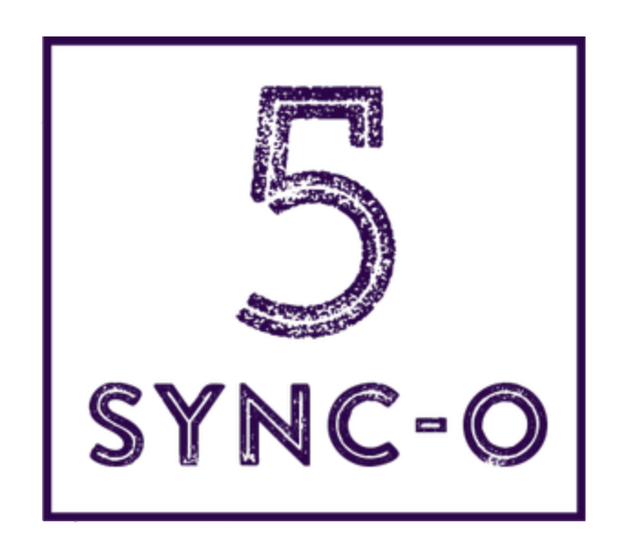

# sync-hackthon-back

<div style="text-align:center"></div>

## Conceito 
 É um servidor destinado a acesso demo dos dados de usuários, com conexao no servidor mongodb.


# Funcionalidades

## websocket
- Conexão broadcast acessada para chat em: wss://sync-o-back.herokuapp.com/
- Formato da mensagem
```
{
    'name': <nome>,
    'data': <texto>
}
```

## requests

- Acesso aos dados no banco de dados
- formato

- - GET  -> lista de usuarios -> https://sync-o-back.herokuapp.com/users/
- - GET  -> dados de um usuário com base ID -> https://sync-o-back.herokuapp.com/users/:id
- - POST  -> dados de um usuário com base ID -> https://sync-o-back.herokuapp.com/users/register
```
{
    "email":<email>,
    "pass":<pass>,
    "score": <score>
}
```
- - POST  -> Login -> https://sync-o-back.herokuapp.com/users/login
```
{
    "email":<email>,
    "pass":<pass>
}
```
- - POST  -> Altera dados com base no ID-> https://sync-o-back.herokuapp.com/users/:id
```
{
    "email":<email>,
    "pass":<pass>,
    "score": <score>
}
```

